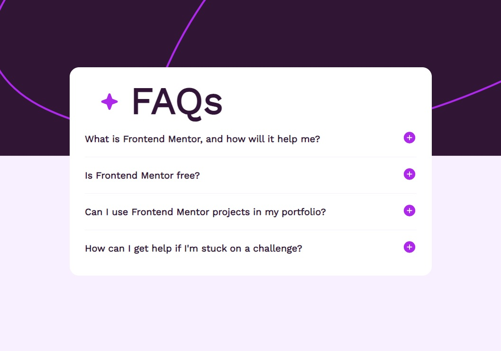
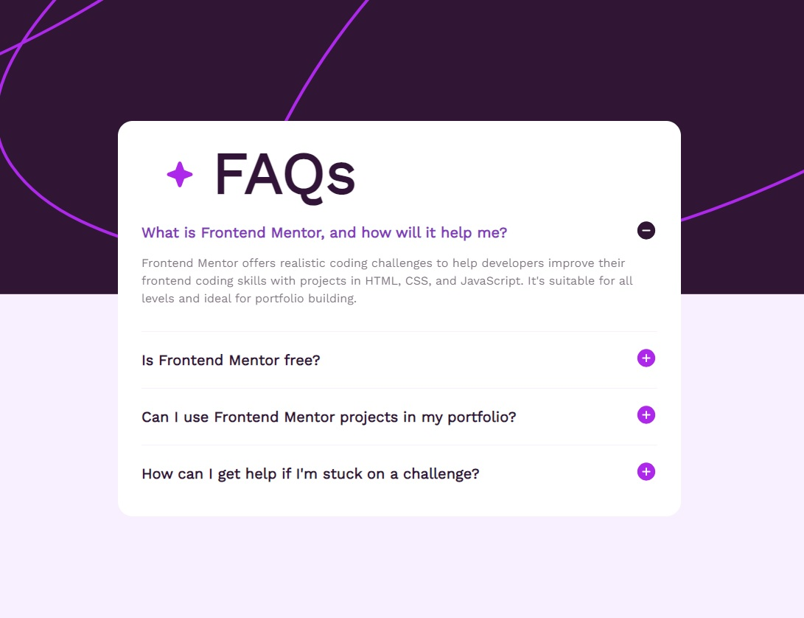

# FAQ Accordion

## About

This little project consists of some questions and answers, where the user can click on the question to find out the answer. But main aim of the project was learn about web components, but no frameworks were used, only html, css and javaScript.
This project is one of the challenges of FrontEnd Mentor website.

## Technologies

1. HTML
2. CSS
3. JavaScript

## Screens

